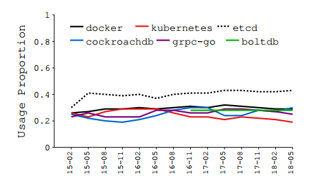
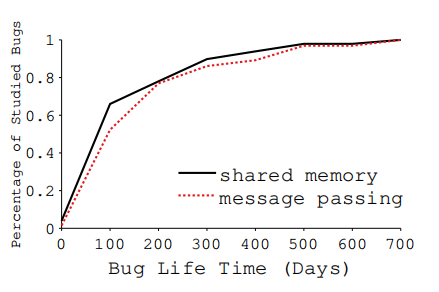
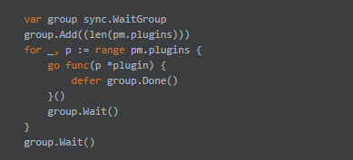
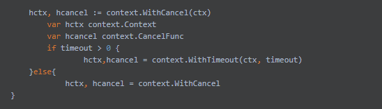
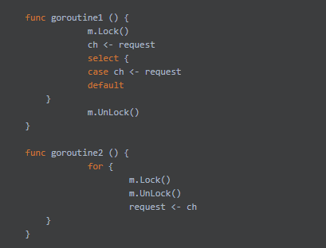

# Understanding Real-World Concurrency Bugs in Go

[English edition](https://github.com/luqinwen/URWCBG/blob/main/go-study.pdf)

Understanding Real-World Concurrency Bugs in Go<br>
了解Go中的真实世界并发错误

## 摘要

Go是一种静态类型的编程语言，旨在提供一种简单、高效、安全的方法来构建多线程软件。自2009年创立以来，Go已在生产和开源软件中获得了大量采用。Go提倡使用mes-sage传递作为线程间通信的手段，并提供了几种新的并发机制和库来简化多线程编程。了解这些新建议的含义以及消息传递和共享内存同步在程序错误或错误方面的比较非常重要。不幸的是，据我们所知，目前还没有关Go一致性错误的研究。

在本文中，我们对真实Go程序中的并发错误进行了首次系统研究。我们研究了六种流行的Go软件，包括Docker、Kubernetes和gRPC。我们总共分析了171个并发错误，其中一半以上是由非传统的Go特定问题引起的。除了这些bug的根本原因之外，我们还研究了它们的修复方法，进行了实验以重现它们，并使用两个公开可用的Go bug检测器对它们进行了评估。总体而言，我们的研究提供了对Go并发模型的更好理解，并可以指导未来的研究人员和从业者编写更好、更可靠的Go软件，以及开发Go调试和诊断工具。

**关键词：Go；并发错误；Bug研究**


## _CSS概念_·计算方法&rarr;当前编程语言；·软件及其工程&rarr;软件测试和调试

## 1. 简介
Go是一种静态类型语言，最初由谷歌于2009年开发。在过去的几年中，它很快获得了吸引力，现在在实际生产中被许多类型的软件所采用。这些Go应用范围从库和高级软件到云基础设施软件，如容器系统和关键值数据库。

Go的一个主要设计目标是改进传统的多线程编程语言，使并发编程更容易，更不容易出错。为此，Go将其多线程设计集中在两个原则上：
1）使线程（称为goroutines）轻量级且易于创建；
2）使用显式消息传递（称为通道）跨线程通信。
凭借这些设计原则，Go不仅提出了一组新的原语和新的库，还提出了现有语义的新实现。了解Go的新并发原语和机制如何影响并发错误是至关重要的，这是传统多线程程序设计语言中最难调试和研究最广泛的错误类型 。
不幸的是，以前没有研究Go并发错误的工作。因此，到目前为止，尚不清楚这些并发机制是否真的
与传统语言相比，Go更容易编程，更不容易出错。

在本文中，我们使用六个开源的生产级Go应用程序对 Go并发bug进行了第一次实证研究：Docker和 Kubernetes，两个数据中心容器系统，etcd，一个分布式键值存储系统，gRPC，一个RPC库，以
及Cock-roachDB和BoltDB，两个数据库系统。

总共，我们研究了这些应用程序中的171个并发错误。我们分析了它们的根本原因，进行了复制它们的实验，并检查了它们的修复补丁。
最后，我们用两个现有的Go并发bug检测器（唯一公开可用的）测试了它们。

我们的研究集中于并发编程中一个长期存在的基本问题：**消息传递和共享内存之间**，这些线程间通信机制中哪一种更不容易出错。
Go是研究这个问题的完美语言，因为它为共享内存和消息传递提供了框架。然而，它鼓励在共享内存上使用通道，并认为显式消息传递不易出错

为了理解Go编程bug以及消息传递和共享内存之间的比较，我们建议按照两个正交维度对比赛bug进行分类： bug的**原因**及其**行为**。
沿着原因维度，我们将错误分为**滥用共享内存**导致的错误和**滥用消息传递**导致的错误。沿着第二个维度，我们将bug分为涉及（任意数量）无法继续的goroutine的bug（我们称之为**阻塞bug**）和不涉及任何阻塞的bug（**非阻塞bug**）。

令人惊讶的是，我们的研究表明，使用消息传递和共享内存一样容易产生并发错误，有时甚至更多。例如，大约58%的阻塞错误是由消息传递引起的。除了违反Go的通道使用规则（例如，在没有人向其发送数据或关闭的通道上等待）之外，许多并发错误是由消息传递和其他新语义以及Go中的新库的混合使用导致的，这些错误很容易被忽略，但很难检测到。

为了演示消息传递中的错误，我们在图1中使用了Kubernetes中的一个阻塞错误。
finishRequest函数在第4行使用匿名函数创建子goroutine来处理请求，这是Go服务器程序中的常见做法。
子goroutine执行fn（），并通过第6行的通道ch将结果发送回父goroutine。
子协程将在第6行阻塞，直到父级从第9行的ch中提取结果。同时，父级将在select时阻塞，
直到子协程将结果发送给ch（第9行）或发生超时（第11行）。
如果超时提前发生，或者如果Go运行时（非确定性）在两个情况都有效的情况下选择了第11行的情况，
则父级将从第12行的requestReq（）返回，其他任何人都不能再从ch中提取结果，导致子协程永远被阻止。
修复方法是将ch从非缓冲通道更改为缓冲通道，这样子goroutine即使在父级退出时也可以始终发送结果。

```go
func finishReq(timeout time.Duration) r ob{
	ch := make(chan ob)
	// ch := make(chan ob,1)
	go func() {
		result := fn()
		ch <- result
    }()
	select {
	case result = <- ch:
	    return result
	case <- time.After(timeout):
		return nil
    }
}
```


这个错误演示了在Go中使用新特性的复杂性，以及像这样编写正确的Go程序的困难。
程序员必须对使用匿名函数创建goroutine，Go简化goroutine创建的特性，缓冲与非缓冲通道的使用，使用select等待多通道操作的非确定性，以及特殊的时间库有一个清晰的理解。
尽管这些特性都是为了简化多线程编程，但在现实中，很难用它们来编写正确的Go程序。

总的来说，我们的研究揭示了Go并发编程的新实践和新问题，并为消息传递与共享内存访问的争论提供了答案。我们的发现提高了对Go并发性的理解，并可以为未来的工具设计提供有价值的指导。本文的关键贡献如下。

- 我们使用6个现实世界的生产级Go应用程序对Go并发漏洞进行了首次实证研究。
- 我们对Go并发错误的原因、修复和检测进行了9个高级关键观察。它们对Go程序员的参考资料很有用。我们进一步对我们的研究结果的含义进行了8个见解，以指导未来关于Go开发、测试和错误检测的研究。
- 我们提出了根据错误的原因和行为的两个维度对并发错误进行分类的新方法。这种分类方法帮助我们更好地比较不同的并发机制以及bug原因和修复之间的相关性。我们相信其他的bug研究也可以使用类似的分类法方法。

我们所有的研究结果和所研究的提交日志都可以在https://github.com/system-pclub/go-concurrency-bugs上找到。
## 2. 背景和应用
Go是一种静态类型编程语言，从第一天就为并发编程而设计。
几乎所有主要的Go修订都包括对其并发软件包的改进。本节简要介绍了Go的并发机制的背景知识，包括它的线程模型、线程间通信方法和线程同步机制。我们还介绍了我们为本研究选择的六个Go应用程序。
### 2.1 协程（goruntine）
Go使用了一个被称为goruntine的概念作为它的并发单元。goroutine是**轻量级的用户级线程**，Go的runtime库管理它，并以M：N的方式将其映射到内核级线程。可以通过简单地在函数调用之前添加关键字go来创建一个协程（goruntine）。

为了使协程易于创建，Go还支持使用匿名函数创建一个新的协程，一个没有标识符或“名称”的函数定义。
在匿名函数之前声明的所有局部变量都可以被匿名函数访问，并且可能在父协程和使用匿名函数创建的子协程之间共享，从而导致数据竞争（第6节）。

### 2.2 与共享内存的同步
Go支持跨协程的传统共享内存访问。它支持各种传统的同步原语，如锁/解锁（Mutex）、读/写锁（RWMutex）、条件变量（Cond）和原子读/写（原子）。
Go的RWMutex的实现与C语言中的pthread_rwlock_t不同。Go中的写锁请求比读锁请求有更高的优先级。

作为Go引入的一个新的原语，Once被设计为保证一个函数只执行一次。它有一个Do方法，用一个函数f作为参数。当Once.Do (f)被多次调用，只会执行第一次的调用。Once被广泛用于确保共享变量只被多个程序初始化一次。

与C中的pthread_join类似，Go使用WaitGroup允许多个goroutine在等待的goroutine之前完成其共享变量访问。
通过调用Add将Goroutine添加到WaitGroup。WaitGroup中的goroutine使用Done来通知其完成，而goroutine调用Wait来等待WaitGroup内所有goroutine的完成通知。
误用WaitGroup会导致阻塞错误（第5节）和非阻塞错误（6节）。
### 2.3 与消息传递的同步
通道（chan）是Go引入的一种新的并发原语，用于跨发送数据和状态，并构建更复杂的功能。
Go支持两种类型的通道：缓冲和非缓冲。
向非缓冲通道发送数据（或从其接收）数据将阻塞一个协程（goruntine），直到另一个协程从该通道接收数据（或发送数据）。
当缓冲区已满时，发送到缓冲通道只会阻塞。在使用通道中有几个基本规则，违反这些规则可能会产生并发错误。
例如，通道只能在初始化后使用，并且发送数据到（或接收数据）一个nil通道将永远阻塞一个协程。将数据发送到已关闭的通道或关闭已经关闭的通道可能会引发panic。

selcet语句允许一个程序等待多个信道操作。selcet将被阻塞，直到它的一个case被触发，或者当它能够执行default分支时。
当一个select中的多个case有效时，Go将随机选择一个来执行。这种随机性可能会导致并发错误，这将在第6节中讨论。

Go引入了几种新的语义来简化多个协程之间的交互。例如，为了通过生成一组协同工作的goroutine来帮助服务用户请求的编程模型，Go引入了上下文来跨goroutine承载请求特定的数据或元数据。
另一个例子是，Pipe被设计用于在读取器和写入器之间流化数据。上下文和管道都是传 递消息的新形式，滥用它们可能会创建新的并发bug类型（第5节）。

### 2.4 Go 应用
近年来，Go语言的流行程度和应用程度迅速增加。Go是2017年上GitHub上第9种最受欢迎的语言。截至撰写本文时，已有187K个Github仓库用Go编写。
在本研究中，我们选择了6个用Go编写的具有代表性的真实软件，包括两个容器系统（Docker和Kubernetes），一个键值存储系统（etcd），两个数据库（CockroachDB和BoltDB）和一个RPC库（如表1所示）。这些应用程序都是在数据中心环境中获得了广泛应用的开源项目。
例如，Docker和Kubernetes是在GitHub上编写的最流行的两个应用程序，有48.9K和36.5Kstar（etcd是第10位，其余的都排在前100名）。
我们所选择的应用程序都有至少三年的开发历史，并且目前都由开发人员积极维护。我们选择的应用程序都是中等到大型，代码行从9000到200万不等。
在这六个应用程序中，Kubernetes和gRPC都是谷歌最初开发的项目。

表1 选择应用的信息：主要包括在github上的Star、commit、贡献者、源代码的行数以及在github上的发展历史

|     应用程序      |  Star  | Commit  |  贡献者  |  LOC   |  Dev 历史   |
|:-------------:|:------:|:-------:|:-----:|:------:|:---------:|
|    Docker     | 48975  |  35149  | 1767  |  786K  | 4.2Years  |
|  Kubernetes   | 36581  |  65684  | 1679  | 2297K  | 3.9Years  |
|     etcd      | 18417  |  14101  |  436  |  441K  | 4.9Years  |
|  CockroachDB  | 13461  |  29485  |  197  |  520K  | 4.2Years  |
|     gRPC      |  5594  |  2528   |  148  |  53K   | 3.3Years  |
|    BoltDB     |  8530  |   816   |  98   |   9K   | 4.4Years  |
## 3. Go并发使用模式
在研究Go并发bugs之前，首先了解现实世界的Go并发程序是怎么样的。本节将介绍我们选择的六个应用程序中的基本程序用法和Go并发原语用法的静态和动态分析结果。
### 3.1 Goruntine 用途
要理解Go中的并发性，我们首先应该了解goroutine在真实世界的Go程序中是如何使用的。
Go中的一个设计理念是使goroutine轻量级且易于使用。因此，我们会问“真正的Go程序员是否倾向于使用许多goroutine（静态）编写代码？
”和“真正的Go应用程序是否在运行时（动态）创建了大量goroutine？”

为了回答第一个问题，我们收集了goroutine创建站点的数量（即创建goroutine的源代码行）。表2总结了结果。
总体而言，这六个应用程序使用了大量的goroutine。每千条源代码的平均创建位置范围在0.18到0.83之间。
我们进一步将创建站点分为使用普通函数创建goroutine的站点和使用匿名函数的站点。
除了Kubernetes和BoltDB之外，所有应用程序都使用更多的匿名函数。

表格2 协程/线程创建站点的数量。使用普通函数和匿名函数的goroutine/线程创建站点的数量，创建站点的总数，以及每千行代码的创建站点。

|    应用程序     | 普通函数 | 匿名函数 | 站点总数 | 每千行代码的创建站点 |
|:-----------:|:----:|:----:|:----:|:----------:|
|   Docker    |  33  | 112  | 145  |    0.18    |
| Kubernetes  | 301  | 233  | 534  |    0.23    |
|    etcd     |  86  | 211  | 297  |    0.67    |
| CockroachDB |  27  | 125  | 152  |    0.29    |
|   BoltDB    |  2   |  0   |  2   |    0.22    |
|   gRPC-C    |  5   |  -   |  5   |    0.03    |
|   gRPC-Go   |  14  |  30  |  44  |    0.83    |

为了理解Go和传统语言之间的区别，我们还分析了gRPC的另一种实现，即gRPC-C，它是在C/C++中实现的。gRPC-C包含140K行代码，也由Google的gRPC团队维护。与gRPC-Go相比，gRPC-C具有惊人的
很少创建线程（每个KLOC只有五个创建站点和0.03个站点）。

我们进一步研究了goroutine的运行时创建。我们运行了gRPCGo和gRPC-C来处理三个性能基准，这些基准旨在比较用不同编程语言编写的多个gRPC版本的性能。这些基准测试使用不同的消息格式、不同数量的连接以及同步和异步RPC请求来配置gRPC。由于gRPC-C比gRPC-Go更快，因此我们运行gRPC-C和gRPC-Go来处理相同数量的RPC请求，
而不是相同的总时间量。

表3显示了运行这三个工作负载时，gRPC-Go中创建的goroutine数与gRPC-C中创建的线程数的比率。
在客户端和服务器端的不同工作负载上创建了更多的goroutine。
表3还展示了我们对goroutine运行时持续时间的研究结果，并将其与gRPC-C的线程运行时持续进行了比较。
由于gRPC-Go和gRPC-C的总执行时间不同，比较绝对goroutine/线程持续时间没有意义，
因此我们报告并比较相对于gRPC-Go与gRPC-C总运行时间的goroutine/thread持续时间。
具体来说，我们计算所有goroutine/线程的平均执行时间，并使用程序的总执行时间将其标准化。
我们发现gRPC-C中的所有线程都从整个程序的开始到结束执行（即100%），因此表3中只包含了gRPC-Go的结果。
对于所有工作负载，goroutine的标准化执行时间都比线程短。
<table >
    <caption>表3 在执行RPC基准测试时提供的动态信息。goroutine数除以线程数的比率，以及由整个应用程序的执行时间归一化的平均goroutine执行时间。</caption>
    <tr>
	    <th rowspan="2">工作量</th>
	    <th colspan="2">协程/线程</th>
	    <th colspan="2">平均执行时间</th>  
    </tr >
    <tr>
	    <th>客户端</th>
	    <th>服务端</th>  
        <th>客户端-Go</th>
	    <th>服务端-Go</th>
    </tr >
    <tr>
	    <th>g_sync_ping_pong</th>
	    <th>7.33</th>  
        <th>2.67</th>
	    <th>63.65%</th>
        <th>76.97%</th>
    </tr > 
    <tr>
        <th>sync_ping_pong</th>
	    <th>7.33</th>  
        <th>4</th>
	    <th>63.23%</th>
        <th>76.57%</th>
    </tr>
    <tr>
        <th>qps_unconstrained</th>
	    <th>201.46</th>  
        <th>6.36</th>
	    <th>91.05%</th>
        <th>92.73%</th>
    </tr>
</table>

**发现1：** Goroutine的执行时间比C更短，但创建频率更高（无论在静态还是运行时）。
### 3.2 并发原语用法
在对现实世界Go程序中的goroutine用法有了基本了解之后，我们接下来将研究goroutine如何在这些程序中进行通信和同步。
具体来说，我们计算了六个应用程序中不同类型并发原语的使用情况。
表4显示了总的（原语使用的绝对数量）以及每种类型的原语占总原语的比例。
共享内存同步操作的使用频率高于消息传递，Mutex是所有应用程序中使用最广泛的原语。
对于消息传递原语，chan是使用频率最高的一种，从18.48%到42.99%不等。

<table >
    <caption>表4 并发原语用法。Mutex列包括互斥锁和读写锁。</caption>
    <tr>
	    <th rowspan="2">应用程序</th>
	    <th colspan="5">共享内存</th>
	    <th colspan="2">消息传递</th> 
        <th rowspan="2">总和</th>
    </tr >
    <tr>
	    <th>锁（读写、互斥锁）</th>
	    <th>原子操作</th>  
        <th>Once操作</th>
	    <th>WaitGroup</th>
        <th>Cond</th>
        <th>chan</th>
        <th>Misc.</th>
    </tr >
    <tr>
        <th>Docker</th>
	    <th>62.62%</th>  
        <th>1.06%</th>
	    <th>4.75%</th>
        <th>1.70%</th>
        <th>0.99%</th>
        <th>27.87%</th>
        <th>0.99%</th>
        <th>1410</th>
    </tr > 
    <tr>
        <th>Kubernetes</th>
	    <th>70.34%</th>  
        <th>1.21%</th>
	    <th>6.13%</th>
        <th>2.68%</th>
        <th>0.96%</th>
        <th>18.48%</th>
        <th>0.20%</th>
        <th>3951</th>
    </tr>
    <tr>
        <th>etcd</th>
	    <th>45.01%</th>  
        <th>0.63%</th>
	    <th>7.18%</th>
        <th>3.95%</th>
        <th>0.24%</th>
        <th>42.99%</th>
        <th>0</th>
        <th>2075</th>
    </tr>
    <tr>
        <th>CockroachDB</th>
	    <th>55.90%</th>  
        <th>0.49%</th>
	    <th>3.76%</th>
        <th>8.57%</th>
        <th>1.48%</th>
        <th>28.23%</th>
        <th>1.57</th>
        <th>3245</th>
    </tr>
    <tr>
        <th>gRPC-GO</th>
	    <th>61.20%</th>  
        <th>1.15%</th>
	    <th>4.20%</th>
        <th>7.00%</th>
        <th>1.65%</th>
        <th>23.03%</th>
        <th>1.78%</th>
        <th>786</th>
    </tr>
    <tr>
        <th>BoltDB</th>
	    <th>70.21%</th>  
        <th>2.13%</th>
	    <th>0</th>
        <th>0</th>
        <th>0</th>
        <th>23.40%</th>
        <th>4.26%</th>
        <th>47</th>
    </tr>
</table>

我们进一步比较了gRPC-C和gRPC-Go中并发原语的用法。
gRPC-C只使用锁，它在746个地方使用（每个KLOC使用5.3个原语）。
gRPC Go在786个位置使用八种不同类型的原语（每个KLOC使用14.8个原语）。
显然，与gRPC-C相比，gRPCGo使用的并发原语数量更大，种类也更多。

接下来，我们将研究并发原语的用法如何随时间变化。
图2和图3显示了2015年2月至2018年5月六个应用程序中共享内存和消息传递原语的使用情况。
总的来说，随着时间的推移，
这些用法趋于稳定，这也意味着我们的研究结果将对未来的Go程序员有价值。




**发现2**：尽管传统的共享内存线程通信和同步仍然被大量使用，但Go程序员也使用大量的消息传递原语。

**启发1**：随着goroutine和新类型的并发原语的大量使用，Go程序可能会引入更多的并发bug。
## 4 Bug的研究方法
本节将讨论我们如何在本研究中收集、分类和复制并发错误。

**收集并发错误**。为了收集并发错误，我们首先过滤了六个应用的GitHub提交历史，
通过在提交日志中搜索与并发相关的关键字，
包括“竞争”、“死锁”、“同步”、“并发”、“锁”、“互斥锁”、“原子操作”、“competite”、“上下文”、“once”和“goroutine 泄漏”。
其中一些关键字在以前的工作中用于收集并发性其他语言的错误。
其中一些与Go引入的新并发原语或库有关，例如“once”和“context”。其中之一，”goruntine 泄漏“，与Go中的一个特殊问题有关。
总共，我们发现3211个不同的提交符合我们的搜索条件。

然后，我们对过滤后的提交进行随机抽样，确定修复并发错误的提交，并手动研究它们。
许多与bug相关的提交日志也提到了相应的bug报告，我们还研究这些报告进行bug分析。
我们总共研究了171个并发漏洞。

**Bug 分类**。我们提出了一种根据两个正交维度对Go并发错误进行分类的新方法。第一个维度是基于bug的行为。
如果一个或多个goroutine在执行过程中被无意地卡住而无法前进，我们称这种并发问题为阻塞错误。
相反，如果所有的goroutine都可以完成任务，但它们的行为不被期望，我们称这一类为非阻塞的。
大多数先前的并发bug研究将bug分为死锁bug和非死锁bug， 其中死锁包括跨多个线程循环等待的情况。
我们对阻塞的定义比死锁更广泛，包括没有循环等待但一个（或多个）goroutine等待其他goroutine无法提供的资源的情况。
正如我们将在第5节中所展示的，相当多的Go并发bug都属于这种类型。
我们认为，随着像Go这样的新语言的新编程习惯和语义，我们应该更加关注这些非死锁阻塞错误，并扩展传统的并发错误分类机制。

第二个维度是并发bugs的原因。当多个线程尝试通信时，并发错误就会发生，并且在通信过程中会发生错误。
此，我们的想法是通过不同的goroutine如何通信来分类并发错误的原因：通过访问共享内存或消息传递。
这种分类可以帮助程序员和研究人员选择更好的方式来执行线程间通信，并在执行此类通信时检测和避免潜在错误。

根据我们的分类方法，共有85个阻塞错误和86个非阻塞错误，
共有105个错误是由错误的共享内存保护引起的，66个错误是由于错误的消息传递引起的。
表5显示了每个应用程序中错误类别的详细细分。
<table >
    <caption>表3 分类。这个表显示了我们所研究的错误是如何在不同的类别和应用程序中分布的。</caption>
    <tr>
	    <th rowspan="2">应用程序</th>
	    <th colspan="2">行为</th>
	    <th colspan="2">原因</th>  
    </tr >
    <tr>
	    <th>阻塞</th>
	    <th>非阻塞</th>  
        <th>共享内存</th>
	    <th>消息传递</th>
    </tr >
    <tr>
	    <th>Docker</th>
	    <th>21</th>  
        <th>23</th>
	    <th>28</th>
        <th>16</th>
    </tr > 
    <tr>
        <th>Kubernetes</th>
	    <th>17</th>  
        <th>17</th>
	    <th>20</th>
        <th>14</th>
    </tr>
    <tr>
        <th>etcd</th>
	    <th>21</th>  
        <th>16</th>
	    <th>18</th>
        <th>19</th>
    </tr>
    <tr>
        <th>CockroachDB</th>
	    <th>12</th>  
        <th>16</th>
	    <th>23</th>
        <th>5</th>
    </tr>
    <tr>
        <th>gRPC</th>
	    <th>11</th>  
        <th>12</th>
	    <th>12</th>
        <th>11</th>
    </tr>
    <tr>
        <th>BoltDB</th>
	    <th>3</th>  
        <th>2</th>
	    <th>4</th>
        <th>1</th>
    </tr>
    <tr>
        <th>总计</th>
	    <th>85</th>  
        <th>86</th>
	    <th>105</th>
        <th>66</th>
    </tr>
</table>

我们进一步分析了我们研究的bug的生存时间，
即从将bug代码添加（提交）到软件到在软件中修复（提交bug修复补丁）的时间。
如图4所示，我们研究的大多数bug（共享内存和消息传递）都有很长的生存时间。
我们还发现，报告这些错误的时间接近修复它们的时间。这些结果表明，我们研究的大多数错误都不容易被触发或检测到，但一旦被触发，它们很快就被修复了。
因此，我们认为这些bug是非常重要的，值得仔细研究。



**复制并发错误**。为了评估内置的死锁和数据竞争检测技术，我们复制了21个阻塞错误和20个非阻塞错误。
为了重现bug，我们将应用程序回滚到bug版本，构建bug版本，并使用bug报告中描述的bug触发输入运行构建的程序。
我们利用错误报告中提到的症状来决定是否成功复制了错误。由于其非确定性，并发错误很难再现。
有时，我们需要多次运行一个有问题的程序，或者手动为一个有错误的程序添加睡眠。
对于未再现的bug，这要么是因为我们没有找到一些依赖库，要么是因为没有观察到所描述的症状。

**有效性的威胁**。对我们研究有效性的威胁可能来自多个方面。我们选择了六个具有代表性的Go应用程序。
在Go中实现了许多其他应用程序，它们可能没有相同的并发问题。
我们只研究了已修复的并发错误。可能有其他并发bug很少被复制，开发人员也从未修复过。
对于一些固定的并发错误，提供的信息太少，难以理解。
我们的研究中没有包含这些错误。
尽管有这些限制，我们还是尽了最大努力收集真实世界的Go并发错误，并进行了全面而公正的研究。
我们相信，我们的研究结果足够普遍，足以启发和指导未来Go并发bug的研究。

## 5 阻塞bugs
本节介绍了我们对阻塞错误的研究结果，包括其根本原因、修复方法以及内置运行时Go死锁检测器在检测阻塞情况方面的有效性。

### 5.1 阻塞bugs的根本原因

当一个或多个goroutine执行等待资源的操作，并且这些资源永远不可用时，就会出现阻塞错误。
要检测并避免阻塞错误，了解其根本原因很重要。我们通过检查哪个操作阻止了一个goroutine，以及为什么其他goroutine没有阻止该操作，来研究阻止bug的根本原因。
使用错误分类的第二个维度，我们将阻塞错误分为旨在保护共享内存访问的阻塞操作和消息传递操作导致的阻塞错误。
表6总结了所有阻塞错误的根本原因。

<table >
    <caption>表6 阻塞错误的原因。Wait包括Cond和WaitGroup中的Wait函数。Chan表示信道操作，Chan w/表示具有其他操作的信道操作。Lib代表与消息传递相关的Go库。</caption>
    <tr>
	    <th rowspan="2">应用程序</th>
	    <th colspan="3">共享内存</th>
	    <th colspan="3">消息传递</th>  
    </tr >
    <tr>
	    <th>互斥锁</th>
	    <th>读写锁</th>  
        <th>等待</th>
	    <th>Chan</th>
        <th>Chan w/</th>
        <th>Lib</th>
    </tr >
    <tr>
	    <th>Docker</th>
	    <th>9</th>  
        <th>0</th>
	    <th>3</th>
        <th>5</th>
        <th>2</th>
        <th>2</th>
    </tr > 
    <tr>
        <th>Kubernetes</th>
	    <th>6</th>  
        <th>2</th>
	    <th>0</th>
        <th>3</th>
        <th>6</th>
        <th>0</th>
    </tr>
    <tr>
        <th>etcd</th>
	    <th>5</th>  
        <th>0</th>
	    <th>0</th>
        <th>10</th>
        <th>5</th>
        <th>1</th>
    </tr>
    <tr>
        <th>CockroachDB</th>
	    <th>4</th>  
        <th>3</th>
	    <th>0</th>
        <th>5</th>
        <th>0</th>
        <th>0</th>
    </tr>
    <tr>
        <th>gRPC</th>
	    <th>2</th>  
        <th>0</th>
	    <th>0</th>
        <th>6</th>
        <th>2</th>
        <th>1</th>
    </tr>
    <tr>
        <th>BoltDB</th>
	    <th>2</th>  
        <th>0</th>
	    <th>0</th>
        <th>0</th>
        <th>1</th>
        <th>0</th>
    </tr>
    <tr>
        <th>Total</th>
	    <th>28</th>  
        <th>5</th>
	    <th>3</th>
        <th>29</th>
        <th>16</th>
        <th>4</th>
    </tr>
</table>

总的来说，我们发现大约42%的阻塞错误是由保护共享内存的错误引起的，**58%是由消息传递错误**引起的。
考虑到共享内存原语的使用频率比消息传递原语更高（第3.2节），消息传递操作更可能导致阻塞错误。

**发现3**：与消息传递不易出错的普遍观点相反，
我们研究的Go应用程序中更多的阻塞错误是由错误的消息传递引起的，而不是由错误的共享内存保护引起的。

#### 5.1.1 （mis）共享内存的保护
众所周知，共享内存访问很难正确编程，一直是死锁研究的主要焦点之一。
它们继续导致Go中的阻塞bug，既有传统模式，也有新的Go特定原因。

<u>_**互斥锁**_</u> 28个阻塞错误是由误用锁（Mutex）引起的，包括双重锁定、在冲突订单中获取锁以及忘记解锁。这一类别中的所有bug都是传统的bug，我们认为传统的死锁检测算法应该能够通过静态程序分析来检测这些bug。

<u>_**读写锁**_</u> 如第2.2节所述，Go的写锁请求比读锁请求具有更高的权限。
当goroutine（th-A）通过读取两次获取一个RWMutex时，这种独特的锁实现可能会导致阻塞错误
并且这两个读锁操作由来自另一个goroutine（th-B）的写锁定操作交织。
当th-A的第一次读锁定操作成功时，它将阻止th-B的写锁定操作，因为写锁定是互斥的。然而，th-B的写锁定操作也会阻止th-A的第二次读锁定操作，因为写锁定请求在Go的实现中具有更高的权限。
A和B都无法继续。

五个阻塞错误是由这个原因引起的。注意，由于pthread_rwlock_t在默认设置下优先处理读锁请求，相同的交错锁定模式不会导致C中pthread_rwlock_t的阻塞错误。
RWMutex阻塞错误类型意味着，即使Go使用与传统语言相同的并发语义，由于Go对语义的新实现，仍然可能存在新类型的错误。

<u>等待</u> 三个阻塞错误是由于等待操作无法继续。与Mutex和RWMutex相关的bug不同，它们不涉及循环等待。当Cond用于保护共享内存访问并且一个goroutine调用Cond.Wait（）时，
会出现其中两个错误，但之后没有其他goroutine会调用Cond.Signal（）（或Cond.Broadcast（））。

第三个bug，Docker#25384，发生在使用WaitGroup类型的共享变量时，如图5所示。
只有当第5行的Done（）被调用len（pm.plugins）次时，第7行的Wait（）才能解除阻止，因为len（pm.plugin）被用作第2行调用Add（）的参数。
然而，Wait（）在循环中被调用，因此它在以后的迭代中阻止在第4行创建goroutine，并阻止在每个创建的goroutine中调用Done（）。
修复此错误的方法是将Wait（）的调用从循环中移出。


```go
    var group sync.WaitGroup
    group.Add((len(pm.plugins)))
    for _, p := range pm.plugins {
        go func(p *plugin) {
            defer group.Done()
        }()
        group.Wait()
    }
    group.Wait()
```



尽管条件变量和线程组等待都是传统的并发技术，但我们怀疑Go的新编程模型是程序员产生这些并发错误的原因之一。
例如，与pthread_join不同，它是一个显式等待（命名）线程完成的函数调用，WaitGroup是一个可以在goroutine之间共享的变量，它的Wait函数隐式等待Done函数。

**发现4**：大多数由共享内存同步引起的阻塞错误与传统语言的原因和修复方法相同。
然而，由于Go对现有原语的新实现或其新的编程语义，其中一些语言与传统语言不同。

#### 5.1.2 错误使用消息传递

我们现在讨论由消息传递错误引起的阻塞错误，这与我们所研究的应用程序中阻塞错误的主要类型相反。
使用Channel在goroutine之间传递消息时出错导致29个阻塞错误。
许多与Channel相关的阻塞错误是由于缺少发送Channel（或从Channel接收）或关闭Channel导致的，这将导致阻塞等待从Channel接收（或发送到频道）的goroutine。
图1就是一个这样的例子。

当结合Go特殊库的使用时，通道创建和goroutine阻塞可能隐藏在库调用中。
如图6所示，在第1行创建了一个新的上下文对象hcancel。
同时创建一个新的goroutine，消息可以通过hcancel的channel字段发送到新的goroutine。
如果第4行的超时值大于0，则在第5行创建另一个上下文对象，并且hcancel指向新对象。
之后，就无法向或关闭附加到旧对象的goroutine发送消息。
补丁是为了避免在超时大于0时创建额外的上下文对象。
```go
    hctx, hcancel := context.WithCancel(ctx)
	var hctx context.Context
	var hcancel context.CancelFunc
	if timeout > 0 {
		hctx,hcancel = context.WithTimeout(ctx, timeout)
    }else{
	    hctx, hcancel = context.WithCancel
}
```



<u>_通道和其他阻塞原语_</u> 对于16个阻塞错误，一个goroutine在通道操作时被阻塞，
另一个goroutine在锁定或等待时被阻塞。例如，如图7所示，goroutine1在向通道ch发送请求时被阻塞，
而goroutine2在m.Lock（）时被阻塞。
修复方法是为goroutine1添加一个带有默认分支的select，以使ch不再阻塞。

```go
    func goroutine1 () {
		m.Lock()
		ch <- request
		select {
		case ch <- request
		default
        }
		m.UnLock()
    }
	
    func goroutine2 () {
		for {
			m.Lock()
			m.UnLock()
			request <- ch
        }   
    }
```



<u>_消息传递库_</u> Go提供了几个库来传递数据或消息，如Pipe。
如果不正确使用，这些特殊的库调用也会导致阻塞错误。例如，与通道类似，如果管道未关闭，则当goroutine试图向未关闭的管道发送数据或从中提取数据时，它可能会被阻止。
有4个收集到的阻塞错误是由特殊的Go消息传递库调用引起的。

**发现5** 消息传递导致的所有阻塞错误都与Go的新消息传递语义（如通道）有关。
当消息传递操作与其他同步机制一起使用时，这些bugs可能很难检测到。

**含义2** 与通常的看法相反，消息传递可能比共享内存导致更多的阻塞错误。
我们呼吁注意消息传递编程中的潜在危险，并提出了这一领域的错误检测研究问题。

### 5.2 修复阻塞错误

在了解了Go中阻塞bug的原因之后，我们现在分析了Go程序员如何在现实世界中修复这些bug。

消除挂起的goroutine的阻塞原因将解除阻塞，这是修复阻塞错误的一般方法。
为了实现这一目标，Go开发人员经常调整同步操作，包括添加丢失的同步操作、移动或更改错误/误用的同步操作，以及删除多余的同步操作。
表7总结了这些修复。

<table >
    <caption>表7 修复阻塞bugs的策略。下标s表示同步</caption>
    <tr>
	    <th></th>
	    <th>Add_s</th>
	    <th>Move_s</th>
        <th>Change_s</th>
        <th>Remove_s</th>
        <th>Misc</th>
    </tr >
    <tr>
	    <th>共享内存</th>
    </tr >
    <tr>
	    <th>互斥锁</th>
	    <th>9</th>  
        <th>7</th>
	    <th>2</th>
        <th>8</th>
        <th>2</th>
    </tr > 
    <tr>
        <th>等待（Wait）</th>
	    <th>0</th>  
        <th>1</th>
	    <th>0</th>
        <th>1</th>
        <th>1</th>
    </tr>
    <tr>
        <th>读写锁</th>
	    <th>0</th>  
        <th>2</th>
	    <th>0</th>
        <th>3</th>
        <th>0</th>
    </tr>
    <tr>
        <th>消息传递</th>
    </tr>
    <tr>
        <th>Chan</th>
	    <th>15</th>  
        <th>1</th>
	    <th>5</th>
        <th>4</th>
        <th>4</th>
    </tr>
    <tr>
        <th>Chan w/</th>
	    <th>6</th>  
        <th>3</th>
	    <th>2</th>
        <th>4</th>
        <th>1</th>
    </tr>
    <tr>
        <th>Messaging Lib</th>
	    <th>1</th>  
        <th>0</th>
	    <th>0</th>
        <th>1</th>
        <th>2</th>
    </tr>
    <tr>
        <th>总和</th>
	    <th>31</th>  
        <th>14</th>
	    <th>9</th>
        <th>21</th>
        <th>10</th>
    </tr>
</table>

由于错误地保护共享内存访问而导致的大多数阻塞错误都是通过类似于传统死锁修复的方法修复的。
例如，在33个Mutex或RWMutex相关的bug中，有8个通过添加缺失的解锁被修复；9个通过将锁定或解锁操作移动到适当位置而固定；
11个通过移除额外的锁定操作而被固定。

通过在与阻塞程序不同的goroutine上向通道（以及两次向管道）添加丢失的消息或关闭操作，修复了由错误消息传递导致的11个阻塞错误。
通过添加带有默认选项的select（如图7）或在不同频道上操作的case，修复了8个阻塞错误。
与通道相关的阻塞错误的另一个常见修复方法是用缓冲通道替换未缓冲的通道（例如，图1）。
其他与通道相关的阻塞错误可以通过将通道操作移出关键部分和用共享变量替换通道等策略来修复。

为了理解阻塞bug的原因和修复之间的关系，我们应用了一个称为lift的统计度量，这是之前对真实世界bug的实证研究的结果。
lift计算为lift（A，B）=P（AB）/P（A）P（B），其中A表示根本原因类别，B表示修复策略类别，P（AB）表示阻塞由A引起并由B修复的概率。
当lift值等于1时，A根本原因与B修复策略无关。
当lift值大于1时，A和B正相关，这意味着如果阻塞是由A引起的，则更可能由B修复。当lift小于1时，A和B呈负相关。

在所有具有超过10个阻塞错误的错误类别中（我们忽略了具有少于10个错误的类别，
因为它们的统计意义很小），Mutex是与修复类型相关最强的类别，它与lift值为1.52的Moves相关。
Chan和Adds之间的相关性是第二高的，lift值为1.42。
所有其他具有超过10个阻塞错误的类别的lift值都低于1.16，没有显示出强烈的相关性。

我们还根据补丁中使用的并发原语类型分析了阻塞bug的修复。
正如预期的那样，大多数原因与某种类型的基元有关的bug也通过调整该基元来修复。
例如，通过调整Mutex原语修复了所有与Mutex相关的错误。

错误原因与修复错误所用的原语和策略之间的高度相关性，加上Go中的同步原语类型有限，这表明在研究Go中阻塞错误的自动纠正方面取得了丰硕的成果。
我们进一步发现，我们研究的阻塞bug的补丁大小很小，平均有6.8行代码。大约90%的研究阻塞错误是通过调整同步原语来修复的。

**发现6** 我们研究中的大多数阻塞错误（包括传统的共享内存错误和消息传递错误）都可以通过简单的解决方案进行修复， 许多修复与错误原因相关。

**启示3** Go阻塞bug的原因和修复之间的高度相关性及其修复的简单性表明，开发完全自动化或半自动化的工具来修复Go中的阻塞bug是很有希望的。

### 5.3 检测阻塞错误

Go提供了一个内置的死锁检测器，该检测器在goroutine调度程序中实现。
检测器总是在Go运行时启用，并且当运行进程中的goroutine无法取得进展时，它会报告死锁。
我们用Go内置的死锁检测器测试了所有复制的阻塞错误，以评估它能找到什么错误。
对于每一个测试的bug，在每次运行中都可以果断地触发阻塞。
因此，对于每个bug，我们在这个实验中只运行一次。表8总结了我们的测试结果。

<table >
    <caption>表8 死锁检测器的基准和评估结果。</caption>
    <tr>
	    <th>根本原因</th>
	    <th>使用过bugs的</th>
	    <th>检测bugs的</th>
    </tr >
    <tr>
	    <th>互斥锁</th>
	    <th>7</th>  
        <th>1</th>
    </tr > 
    <tr>
        <th>Chan</th>
	    <th>8</th>
	    <th>0</th>
    </tr>
    <tr>
        <th>读写锁</th>
	    <th>4</th>  
        <th>1</th>
    </tr>
    <tr>
        <th>消息传递</th>
	    <th>2</th>  
        <th>0</th>
    </tr>
    <tr>
        <th>总和</th>
	    <th>21</th>  
        <th>2</th>
    </tr>
</table>

内置的死锁检测器只能检测两个阻塞错误，
BoltDB#392和BoltDB#240，
并且在所有其他情况下都会失败（尽管检测器不会报告任何误报）。
内置检测器未能检测到其他阻塞错误的原因有两个。首先，当仍然有一些goroutine在运行时，它不认为被监控的系统是阻塞的。
其次，它只检查goroutine是否在Go并发原语处被阻塞，而不考虑等待其他系统资源的goroutine。
这两个限制很大程度上是由于内置检测器的设计目标是最小化运行时开销。
当在runtime调度程序中实现时，检测器很难在不牺牲性能的情况下有效识别复杂的阻塞错误。

**启发4：** 简单的运行时死锁检测器在检测Go阻塞错误方面并不有效。
未来的研究应该集中在构建新的阻塞错误检测技术上，例如，结合静态和动态阻塞模式检测。

## 6 非阻塞的bugs 

本节介绍了我们对非阻塞错误的研究。
与我们在第5节中所做的类似，我们研究了非阻塞错误的根本原因和修复方法，并评估了Go的内置种族检测器。

### 6.1 非阻塞bugs的根本原因

与阻塞错误类似，我们还将收集到的非阻塞错误分为由于未能保护共享内存而导致的错误和消息传递错误（表9）。

<table >
    <caption>表9 非阻塞错误的根本原因。传统的：传统的非阻塞错误；匿名函数：由匿名函数引起的非阻塞错误；waitgroup：滥用waitgroup；lib:Go库；Chan：滥用管道。</caption>
    <tr>
	    <th rowspan="2">应用程序</th>
	    <th colspan="3">共享内存</th>
	    <th colspan="3">消息传递</th>  
    </tr >
    <tr>
	    <th>传统的方式</th>
	    <th>匿名函数</th>  
        <th>等待组</th>
	    <th>lib</th>
        <th>Chan </th>
        <th>lib</th>
    </tr >
    <tr>
	    <th>Docker</th>
	    <th>9</th>  
        <th>6</th>
	    <th>0</th>
        <th>1</th>
        <th>6</th>
        <th>1</th>
    </tr > 
    <tr>
        <th>Kubernetes</th>
	    <th>8</th>  
        <th>3</th>
	    <th>1</th>
        <th>0</th>
        <th>5</th>
        <th>0</th>
    </tr>
    <tr>
        <th>etcd</th>
	    <th>9</th>  
        <th>0</th>
	    <th>2</th>
        <th>2</th>
        <th>3</th>
        <th>0</th>
    </tr>
    <tr>
        <th>CockroachDB</th>
	    <th>10</th>  
        <th>1</th>
	    <th>3</th>
        <th>2</th>
        <th>0</th>
        <th>0</th>
    </tr>
    <tr>
        <th>gRPC</th>
	    <th>8</th>  
        <th>1</th>
	    <th>0</th>
        <th>1</th>
        <th>2</th>
        <th>0</th>
    </tr>
    <tr>
        <th>BoltDB</th>
	    <th>2</th>  
        <th>0</th>
	    <th>0</th>
        <th>0</th>
        <th>0</th>
        <th>0</th>
    </tr>
    <tr>
        <th>Total</th>
	    <th>46</th>  
        <th>11</th>
	    <th>6</th>
        <th>6</th>
        <th>16</th>
        <th>1</th>
    </tr>
</table>

#### 6.1.1 无法保护共享内存

先前的工作发现，不保护共享内存访问或这种保护中的错误是导致数据争用和其他非死锁错误的主要原因。
同样，我们发现大约80%的收集到的非阻塞错误是由于未受保护或保护错误的共享内存访问造成的。
然而，并不是所有这些错误都与传统语言中的非阻塞错误有相同的原因。

_传统bug_ 我们收集到的非阻塞错误中，有一半以上是由C和Java等经典语言中也会发生的传统问题引起的，如原子性冲突、顺序冲突和数据竞争。
这一结果表明，不同语言的开发人员也会犯同样的错误。
它还表明，应用现有的并发错误检测算法来寻找Go中的新错误是有希望的。

有趣的是，我们发现了七个非阻塞错误，它们的原因是传统的，但主要是由于对新的Go功能缺乏明确的理解。例如，
Docker#22985和CockratchDB#6111是由共享变量上的数据竞争引起的，该共享变量的引用通过通道在goroutines之间传递。


