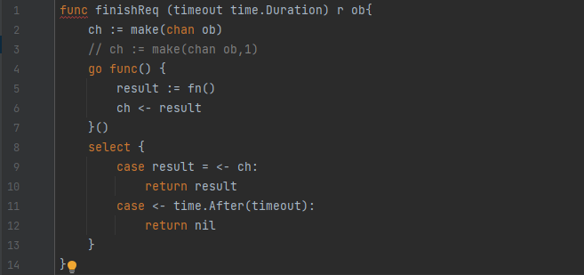

# Understanding Real-World Concurrency Bugs in Go

[English edition](https://github.com/luqinwen/URWCBG/blob/main/go-study.pdf)

Understanding Real-World Concurrency Bugs in Go<br>
了解Go中的真实世界并发错误

## 摘要

Go是一种静态类型的编程语言，旨在提供一种简单、高效、安全的方法来构建多线程软件。自2009年创立以来，Go已在生产和开源软件中获得了大量采用。Go提倡使用mes-sage传递作为线程间通信的手段，并提供了几种新的并发机制和库来简化多线程编程。了解这些新建议的含义以及消息传递和共享内存同步在程序错误或错误方面的比较非常重要。不幸的是，据我们所知，目前还没有关Go一致性错误的研究。

在本文中，我们对真实Go程序中的并发错误进行了首次系统研究。我们研究了六种流行的Go软件，包括Docker、Kubernetes和gRPC。我们总共分析了171个并发错误，其中一半以上是由非传统的Go特定问题引起的。除了这些bug的根本原因之外，我们还研究了它们的修复方法，进行了实验以重现它们，并使用两个公开可用的Go bug检测器对它们进行了评估。总体而言，我们的研究提供了对Go并发模型的更好理解，并可以指导未来的研究人员和从业者编写更好、更可靠的Go软件，以及开发Go调试和诊断工具。

**关键词：Go；并发错误；Bug研究**


## _CSS概念_·计算方法➡当前编程语言；·软件及其工程➡软件测试和调试

## 1. 简介
Go是一种静态类型语言，最初由谷歌于2009年开发。在过去的几年中，它很快获得了吸引力，现在在实际生产中被许多类型的软件所采用。这些Go应用范围从库和高级软件到云基础设施软件，如容器系统和关键值数据库。

Go的一个主要设计目标是改进传统的多线程编程语言，使并发编程更容易，更不容易出错。为此，Go将其多线程设计集中在两个原则上：
1）使线程（称为goroutines）轻量级且易于创建；
2）使用显式消息传递（称为通道）跨线程通信。
凭借这些设计原则，Go不仅提出了一组新的原语和新的库，还提出了现有语义的新实现。了解Go的新并发原语和机制如何影响并发错误是至关重要的，这是传统多线程程序设计语言中最难调试和研究最广泛的错误类型 。
不幸的是，以前没有研究Go并发错误的工作。因此，到目前为止，尚不清楚这些并发机制是否真的
与传统语言相比，Go更容易编程，更不容易出错。

在本文中，我们使用六个开源的生产级Go应用程序对 Go并发bug进行了第一次实证研究：Docker和 Kubernetes，两个数据中心容器系统，etcd，一个分布式键值存储系统，gRPC，一个RPC库，以
及Cock-roachDB和BoltDB，两个数据库系统。

总共，我们研究了这些应用程序中的171个并发错误。我们分析了它们的根本原因，进行了复制它们的实验，并检查了它们的修复补丁。
最后，我们用两个现有的Go并发bug检测器（唯一公开可用的）测试了它们。

我们的研究集中于并发编程中一个长期存在的基本问题：**消息传递和共享内存之间**，这些线程间通信机制中哪一种更不容易出错。
Go是研究这个问题的完美语言，因为它为共享内存和消息传递提供了框架。然而，它鼓励在共享内存上使用通道，并认为显式消息传递不易出错

为了理解Go编程bug以及消息传递和共享内存之间的比较，我们建议按照两个正交维度对比赛bug进行分类： bug的**原因**及其**行为**。
沿着原因维度，我们将错误分为**滥用共享内存**导致的错误和**滥用消息传递**导致的错误。沿着第二个维度，我们将bug分为涉及（任意数量）无法继续的goroutine的bug（我们称之为**阻塞bug**）和不涉及任何阻塞的bug（**非阻塞bug**）。

令人惊讶的是，我们的研究表明，使用消息传递和共享内存一样容易产生并发错误，有时甚至更多。例如，大约58%的阻塞错误是由消息传递引起的。除了违反Go的通道使用规则（例如，在没有人向其发送数据或关闭的通道上等待）之外，许多并发错误是由消息传递和其他新语义以及Go中的新库的混合使用导致的，这些错误很容易被忽略，但很难检测到。

为了演示消息传递中的错误，我们在图1中使用了Kubernetes中的一个阻塞错误。
finishRequest函数在第4行使用匿名函数创建子goroutine来处理请求，这是Go服务器程序中的常见做法。子goroutine执行fn（），并通过第6行的通道ch将结果发送回父goroutine。
子级将在第6行阻塞，直到父级从第9行的ch中提取结果。同时，父级将在select时阻塞，直到子级将结果发送给ch（第9行）或发生超时（第11行）。
如果超时提前发生，或者如果Go运行时（非确定性）在两个情况都有效的情况下选择了第11行的情况，则父级将从第12行的requestReq（）返回，其他任何人都不能再从ch中提取结果，导致子级永远被阻止。修复方法是将ch从非缓冲通道更改为缓冲通道，这样子goroutine即使在父级退出时也可以始终发送结果。

```go
func finishReq(timeout time.Duration) r ob{
	ch := make(chan ob)
	// ch := make(chan ob,1)
	go func() {
		result := fn()
		ch <- result
    }()
	select {
	case result = <- ch:
	    return result
	case <- time.After(timeout):
		return nil
    }
}
```


这个错误演示了在Go中使用新特性的复杂性，以及像这样编写正确的Go程序的困难。
程序员必须对使用匿名函数创建goroutine，Go简化goroutine创建的特性，缓冲与非缓冲通道的使用，使用select等待多通道操作的非确定性，以及特殊的时间库有一个清晰的理解。
尽管这些特性都是为了简化多线程编程，但在现实中，很难用它们来编写正确的Go程序。

总的来说，我们的研究揭示了Go并发编程的新实践和新问题，并为消息传递与共享内存访问的争论提供了答案。我们的发现提高了对Go并发性的理解，并可以为未来的工具设计提供有价值的指导。本文的关键贡献如下。

- 我们使用6个现实世界的生产级Go应用程序对Go并发漏洞进行了首次实证研究。
- 我们对Go并发错误的原因、修复和检测进行了9个高级关键观察。它们对Go程序员的参考资料很有用。我们进一步对我们的研究结果的含义进行了8个见解，以指导未来关于Go开发、测试和错误检测的研究。
- 我们提出了根据错误的原因和行为的两个维度对并发错误进行分类的新方法。这种分类方法帮助我们更好地比较不同的并发机制以及bug原因和修复之间的相关性。我们相信其他的bug研究也可以使用类似的分类法方法。

我们所有的研究结果和所研究的提交日志都可以在https://github.com/system-pclub/go-concurrency-bugs上找到。
## 2. 背景和应用
Go是一种静态类型编程语言，从第一天就为并发编程而设计。
几乎所有主要的Go修订都包括对其并发软件包的改进。本节简要介绍了Go的并发机制的背景知识，包括它的线程模型、线程间通信方法和线程同步机制。我们还介绍了我们为本研究选择的六个Go应用程序。
### 2.1 协程（goruntine）
Go使用了一个被称为goruntine的概念作为它的并发单元。goroutine是**轻量级的用户级线程**，Go的runtime库管理它，并以M：N的方式将其映射到内核级线程。可以通过简单地在函数调用之前添加关键字go来创建一个协程（goruntine）。

为了使协程易于创建，Go还支持使用匿名函数创建一个新的协程，一个没有标识符或“名称”的函数定义。
在匿名函数之前声明的所有局部变量都可以被匿名函数访问，并且可能在父协程和使用匿名函数创建的子协程之间共享，从而导致数据竞争（第6节）。

### 2.2 与共享内存的同步
Go支持跨协程的传统共享内存访问。它支持各种传统的同步原语，如锁/解锁（Mutex）、读/写锁（RWMutex）、条件变量（Cond）和原子读/写（原子）。
Go的RWMutex的实现与C语言中的pthread_rwlock_t不同。Go中的写锁请求比读锁请求有更高的优先级。

作为Go引入的一个新的原语，Once被设计为保证一个函数只执行一次。它有一个Do方法，用一个函数f作为参数。当Once.Do (f)被多次调用，只会执行第一次的调用。Once被广泛用于确保共享变量只被多个程序初始化一次。

与C中的pthread_join类似，Go使用WaitGroup允许多个goroutine在等待的goroutine之前完成其共享变量访问。
通过调用Add将Goroutine添加到WaitGroup。WaitGroup中的goroutine使用Done来通知其完成，而goroutine调用Wait来等待WaitGroup内所有goroutine的完成通知。
误用WaitGroup会导致阻塞错误（第5节）和非阻塞错误（6节）。
### 2.3 与消息传递的同步
通道（chan）是Go引入的一种新的并发原语，用于跨发送数据和状态，并构建更复杂的功能。
Go支持两种类型的通道：缓冲和非缓冲。
向非缓冲通道发送数据（或从其接收）数据将阻塞一个协程（goruntine），直到另一个协程从该通道接收数据（或发送数据）。
当缓冲区已满时，发送到缓冲通道只会阻塞。在使用通道中有几个基本规则，违反这些规则可能会产生并发错误。
例如，通道只能在初始化后使用，并且发送数据到（或接收数据）一个nil通道将永远阻塞一个协程。将数据发送到已关闭的通道或关闭已经关闭的通道可能会引发panic。

selcet语句允许一个程序等待多个信道操作。selcet将被阻塞，直到它的一个case被触发，或者当它能够执行default分支时。
当一个select中的多个case有效时，Go将随机选择一个来执行。这种随机性可能会导致并发错误，这将在第6节中讨论。

Go引入了几种新的语义来简化多个协程之间的交互。例如，为了通过生成一组协同工作的goroutine来帮助服务用户请求的编程模型，Go引入了上下文来跨goroutine承载请求特定的数据或元数据。
另一个例子是，Pipe被设计用于在读取器和写入器之间流化数据。上下文和管道都是传 递消息的新形式，滥用它们可能会创建新的并发bug类型（第5节）。

### 2.4 Go 应用
近年来，Go语言的流行程度和应用程度迅速增加。Go是2017年上GitHub上第9种最受欢迎的语言。截至撰写本文时，已有187K个Github仓库用Go编写。
在本研究中，我们选择了6个用Go编写的具有代表性的真实软件，包括两个容器系统（Docker和Kubernetes），一个键值存储系统（etcd），两个数据库（CockroachDB和BoltDB）和一个RPC库（如表1所示）。这些应用程序都是在数据中心环境中获得了广泛应用的开源项目。
例如，Docker和Kubernetes是在GitHub上编写的最流行的两个应用程序，有48.9K和36.5Kstar（etcd是第10位，其余的都排在前100名）。
我们所选择的应用程序都有至少三年的开发历史，并且目前都由开发人员积极维护。我们选择的应用程序都是中等到大型，代码行从9000到200万不等。
在这六个应用程序中，Kubernetes和gRPC都是谷歌最初开发的项目。

表1 选择应用的信息：主要包括在github上的Star、commit、贡献者、源代码的行数以及在github上的发展历史

|     应用程序      |  Star  | Commit  |  贡献者  |  LOC   |  Dev 历史   |
|:-------------:|:------:|:-------:|:-----:|:------:|:---------:|
|    Docker     | 48975  |  35149  | 1767  |  786K  | 4.2Years  |
|  Kubernetes   | 36581  |  65684  | 1679  | 2297K  | 3.9Years  |
|     etcd      | 18417  |  14101  |  436  |  441K  | 4.9Years  |
|  CockroachDB  | 13461  |  29485  |  197  |  520K  | 4.2Years  |
|     gRPC      |  5594  |  2528   |  148  |  53K   | 3.3Years  |
|    BoltDB     |  8530  |   816   |  98   |   9K   | 4.4Years  |
## 3. Go并发使用模式
在研究Go并发bugs之前，首先了解现实世界的Go并发程序是怎么样的。本节将介绍我们选择的六个应用程序中的基本程序用法和Go并发原语用法的静态和动态分析结果。
